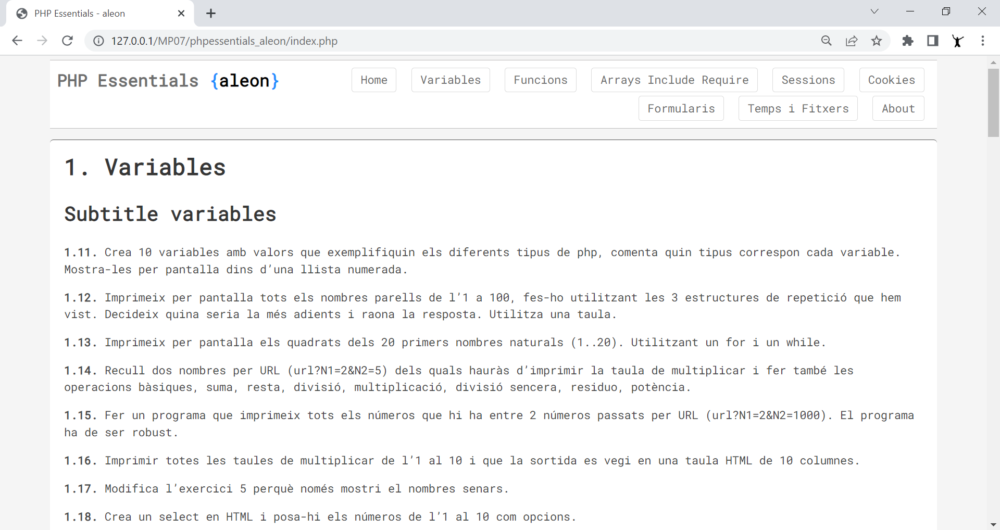

# PHP Essentials by aleon

Recopilació d'exercicis essencials PHP by aleon.

- **Variables** 11 to 110
- **Functions** 21 to 28
- **Arrays, include and require** 31 to 37

## Requeriments

🖥️ php -v
→ PHP 8.0.12 (cli)

🖥️ MySQL
→ Server version: 8.0.28 MySQL Community Server - GPL

## Doc
- https://www.php.net/
- https://www.php.net/manual/en/

## Get Started
- git clone https://github.com/aleongit/phpessentials_aleon.git
- cd phpessentials_aleon
- http://localhost/phpessentials_aleon/ or apache site

